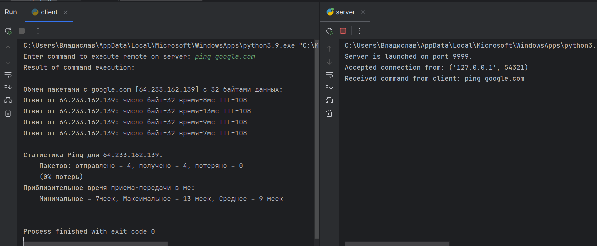
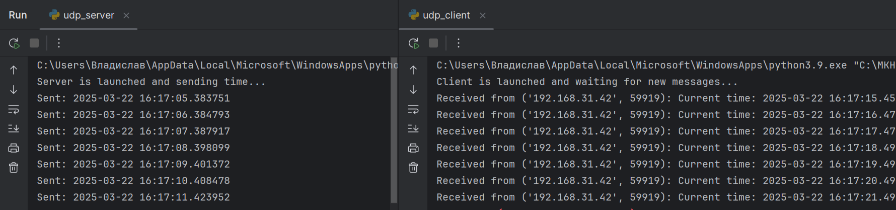

# Практика 5. Прикладной уровень

## Программирование сокетов.

### A. Почта и SMTP (7 баллов)

### 1. Почтовый клиент (2 балла)
Напишите программу для отправки электронной почты получателю, адрес
которого задается параметром. Адрес отправителя может быть постоянным. Программа
должна поддерживать два формата сообщений: **txt** и **html**. Используйте готовые
библиотеки для работы с почтой, т.е. в этом задании **не** предполагается общение с smtp
сервером через сокеты напрямую.

Приложите скриншоты полученных сообщений (для обоих форматов).

#### Демонстрация работы
todo

### 2. SMTP-клиент (3 балла)
Разработайте простой почтовый клиент, который отправляет текстовые сообщения
электронной почты произвольному получателю. Программа должна соединиться с
почтовым сервером, используя протокол SMTP, и передать ему сообщение.
Не используйте встроенные методы для отправки почты, которые есть в большинстве
современных платформ. Вместо этого реализуйте свое решение на сокетах с передачей
сообщений почтовому серверу.

Сделайте скриншоты полученных сообщений.

#### Демонстрация работы
todo

### 3. SMTP-клиент: бинарные данные (2 балла)
Модифицируйте ваш SMTP-клиент из предыдущего задания так, чтобы теперь он мог
отправлять письма с изображениями (бинарными данными).

Сделайте скриншот, подтверждающий получение почтового сообщения с картинкой.

#### Демонстрация работы
todo

---

_Многие почтовые серверы используют ssl, что может вызвать трудности при работе с ними из
ваших приложений. Можете использовать для тестов smtp сервер СПбГУ: mail.spbu.ru, 25_

### Б. Удаленный запуск команд (3 балла)
Напишите программу для запуска команд (или приложений) на удаленном хосте с помощью TCP сокетов.

Например, вы можете с клиента дать команду серверу запустить приложение Калькулятор или
Paint (на стороне сервера). Или запустить консольное приложение/утилиту с указанными
параметрами. Однако запущенное приложение **должно** выводить какую-либо информацию на
консоль или передавать свой статус после запуска, который должен быть отправлен обратно
клиенту. Продемонстрируйте работу вашей программы, приложив скриншот.

Например, удаленно запускается команда `ping yandex.ru`. Результат этой команды (запущенной на
сервере) отправляется обратно клиенту.

#### Демонстрация работы

### В. Широковещательная рассылка через UDP (2 балла)
Реализуйте сервер (веб-службу) и клиента с использованием интерфейса Socket API, которая:
- работает по протоколу UDP
- каждую секунду рассылает широковещательно всем клиентам свое текущее время
- клиент службы выводит на консоль сообщаемое ему время

#### Демонстрация работы

## Задачи

### Задача 1 (2 балла)
Рассмотрим короткую, $10$-метровую линию связи, по которой отправитель может передавать
данные со скоростью $150$ бит/с в обоих направлениях. Предположим, что пакеты, содержащие
данные, имеют размер $100000$ бит, а пакеты, содержащие только управляющую информацию
(например, флаг подтверждения или информацию рукопожатия) – $200$ бит. Предположим, что у
нас $10$ параллельных соединений, и каждому предоставлено $1/10$ полосы пропускания канала
связи. Также допустим, что используется протокол HTTP, и предположим, что каждый
загруженный объект имеет размер $100$ Кбит, и что исходный объект содержит $10$ ссылок на другие
объекты того же отправителя. Будем считать, что скорость распространения сигнала равна
скорости света ($300 \cdot 10^6$ м/с).
1. Вычислите общее время, необходимое для получения всех объектов при параллельных
непостоянных HTTP-соединениях
2. Вычислите общее время для постоянных HTTP-соединений. Ожидается ли существенное
преимущество по сравнению со случаем непостоянного соединения?

#### Решение

- Длина линии: 10 м  
- Скорость передачи: 150 бит/с (15 бит/с на соединение)  
- Размер объекта: 100000 бит  
- Управляющий пакет: 200 бит  
- Соединений: 10  
- Скорость света: $300 \times 10^6$ м/с  
- Объектов: 11 (1 исходный + 10 связанных)
- Задержка распространения: $t_{\text{prop}} = \frac{10}{300 \times 10^6} \approx 3.33 \times 10^{-8} \, \text{с}$ (пренебрежимо мало)  
- Время передачи управляющего пакета: $t_{\text{trans}} = \frac{200}{15} = \frac{40}{3} \approx 13.333 \, \text{с}$  
- Время передачи объекта: $t_{\text{data}} = \frac{100000}{15} = \frac{20000}{3} \approx 6666.667 \, \text{с}$  

## 1. Непостоянные HTTP-соединения
- Время на объект: $T_{\text{obj}} = 4 t_{\text{trans}} + t_{\text{data}} = 4 \times \frac{40}{3} + \frac{20000}{3} = 6720 \, \text{с}$ (TCP-рукопожатие + запрос + данные)  
- T1 (исходный объект): 6720 с  
- T2 (10 объектов параллельно): 6720 с  
- **Общее время**: $6720 + 6720 = 13440 \, \text{с}$  

## 2. Постоянные HTTP-соединения
- Время установления 10 соединений: $3 t_{\text{trans}} = 3 \times \frac{40}{3} = 40 \, \text{с}$  
- Время загрузки одного объекта: $t_{\text{trans}} + t_{\text{data}} = \frac{40}{3} + \frac{20000}{3} \approx 6713.333 \, \text{с}$  
- T1 (исходный объект): 6713.333 с  
- T2 (10 объектов параллельно): 6713.333 с  
- **Общее время**: $40 + 6713.333 + 6713.333 = 13400 \, \text{с}$  

## Вывод
- Время для непостоянных соединений: **13440 с**  
- Время для постоянных соединений: **13400 с**  
- Разница: $13440 - 13400 = 40 \, \text{с}$

### Задача 2 (3 балла)
Рассмотрим раздачу файла размером $F = 15$ Гбит $N$ пирам. Сервер имеет скорость отдачи $u_s = 30$
Мбит/с, а каждый узел имеет скорость загрузки $d_i = 2$ Мбит/с и скорость отдачи $u$. Для $N = 10$, $100$
и $1000$ и для $u = 300$ Кбит/с, $700$ Кбит/с и $2$ Мбит/с подготовьте график минимального времени
раздачи для всех сочетаний $N$ и $u$ для вариантов клиент-серверной и одноранговой раздачи.

#### Решение
- Размер файла: $F = 15 \, \text{Гбит} = 15 \times 1000 = 15000 \, \text{Мбит}$  
- Скорость отдачи сервера: $u_s = 30 \, \text{Мбит/с}$  
- Скорость загрузки каждого пира: $d_i = 2 \, \text{Мбит/с}$  
- Количество пиров: $N = 10, 100, 1000$  
- Скорость отдачи одного пира: $u = 0.3, 0.7, 2 \, \text{Мбит/с}$  

## 1. Клиент-серверная раздача
В этом случае сервер передает файл каждому пиру по отдельности. Минимальное время раздачи определяется как наибольшее значение из времени работы сервера и времени приема данных пиром:  
\[
T_{\text{cs}} = \max\left( \frac{F \cdot N}{u_s}, \frac{F}{d_i} \right)
\]  
- Время загрузки файла одним пиром: $\frac{F}{d_i} = \frac{15000}{2} = 7500 \, \text{с}$ — константа для всех $N$.  
- Время работы сервера: $\frac{F \cdot N}{u_s} = \frac{15000 \cdot N}{30} = 500 \cdot N \, \text{с}$.  

## 2. Одноранговая (P2P) раздача
При P2P-раздаче пиры помогают распространять файл, обмениваясь данными друг с другом. Минимальное время рассчитывается как максимум из трех величин:  
\[
T_{\text{p2p}} = \max\left( \frac{F}{u_s}, \frac{F}{d_i}, \frac{F \cdot N}{u_s + N \cdot u} \right)
\]  
- Время передачи файла сервером: $\frac{F}{u_s} = \frac{15000}{30} = 500 \, \text{с}$.  
- Время загрузки файла одним пиром: $\frac{F}{d_i} = 7500 \, \text{с}$.  
- Общее время с учетом вклада пиров: $\frac{F \cdot N}{u_s + N \cdot u}$ — зависит от значений $N$ и $u$.  

### Задача 3 (3 балла)
Рассмотрим клиент-серверную раздачу файла размером $F$ бит $N$ пирам, при которой сервер
способен отдавать одновременно данные множеству пиров – каждому с различной скоростью,
но общая скорость отдачи при этом не превышает значения $u_s$. Схема раздачи непрерывная.
1. Предположим, что $\dfrac{u_s}{N} \le d_{min}$.
   При какой схеме общее время раздачи будет составлять $\dfrac{N F}{u_s}$?
2. Предположим, что $\dfrac{u_s}{N} \ge d_{min}$. 
   При какой схеме общее время раздачи будет составлять  $\dfrac{F}{d_{min}}$?
3. Докажите, что минимальное время раздачи описывается формулой $\max\left(\dfrac{N F}{u_s}, \dfrac{F}{d_{min}}\right)$?

#### Решение

Рассмотрим клиент-серверную систему раздачи файла размером $F$ бит для $N$ пиров. Сервер способен одновременно передавать данные нескольким пирам с разными скоростями, однако его общая скорость отдачи ограничена значением $u_s$. Раздача происходит непрерывно, а каждый пир имеет свою максимальную скорость загрузки $d_i$, где $d_{\text{min}}$ — минимальная скорость среди всех пиров. Проанализируем условия и определим минимальное время раздачи.

---

#### 1. Случай $\dfrac{u_s}{N} \leq d_{\text{min}}$: Время раздачи $\dfrac{N F}{u_s}$

**Анализ ситуации:**  
Когда средняя скорость, выделяемая сервером на каждого пира, $\dfrac{u_s}{N}$, не превышает минимальную скорость загрузки самого медленного пира $d_{\text{min}}$, сервер может эффективно распределить свою пропускную способность между всеми пирами без ограничений со стороны их возможностей загрузки.

**Схема раздачи:**  
- Сервер делит свою общую скорость $u_s$ равномерно между $N$ пирами, предоставляя каждому пиру скорость $\dfrac{u_s}{N}$.  
- Так как $\dfrac{u_s}{N} \leq d_{\text{min}}$, а $d_{\text{min}} \leq d_i$ для всех пиров, каждый пир способен принимать данные с этой скоростью без каких-либо затруднений.  
- Суммарный объем данных, который необходимо передать всем пирам, составляет $N \cdot F$ бит (по $F$ бит каждому из $N$ пиров).  
- Сервер передает данные с общей скоростью $u_s$, поэтому время, необходимое для завершения раздачи, рассчитывается как:  
  $$
  T = \frac{\text{общий объем данных}}{\text{скорость сервера}} = \frac{N \cdot F}{u_s}
  $$

**Результат:**  
При таком подходе сервер одновременно обслуживает всех пиров, и раздача завершается за время $\dfrac{N F}{u_s}$. Это возможно благодаря тому, что индивидуальные скорости загрузки пиров не становятся ограничивающим фактором.

---

#### 2. Случай $\dfrac{u_s}{N} \geq d_{\text{min}}$: Время раздачи $\dfrac{F}{d_{\text{min}}}$

**Анализ ситуации:**  
Если средняя скорость на пира $\dfrac{u_s}{N}$ равна или превышает $d_{\text{min}}$, то при равномерном распределении некоторые пиры (в частности, самый медленный с $d_i = d_{\text{min}}$) не смогут использовать всю выделенную им скорость. В этом случае время раздачи определяется скоростью загрузки самого медленного пира.

**Схема раздачи:**  
- Самый медленный пир, имеющий скорость загрузки $d_{\text{min}}$, загружает файл размером $F$ бит со своей максимальной скоростью. Время, необходимое ему для завершения загрузки:  
  $$
  T = \frac{F}{d_{\text{min}}}
  $$  
- Чтобы минимизировать общее время, сервер должен распределить свою скорость $u_s$ так, чтобы самый медленный пир получал данные со скоростью $d_{\text{min}}$, а остальные пиры — со скоростями, не превышающими их собственных $d_i$, при этом соблюдая ограничение $u_s$.  
- Условие $\dfrac{u_s}{N} \geq d_{\text{min}}$ означает, что $u_s \geq N \cdot d_{\text{min}}$. Это гарантирует, что сервер обладает достаточной пропускной способностью, чтобы одновременно обеспечить каждому пиру скорость не менее $d_{\text{min}}$.  
- Раздача завершается, когда самый медленный пир полностью загрузит файл, то есть через $\dfrac{F}{d_{\text{min}}}$.

**Результат:**  
В этом случае время раздачи определяется не общей скоростью сервера, а ограничением самого медленного пира, и составляет $\dfrac{F}{d_{\text{min}}}$.