# Практика 9. Сетевой уровень

## Wireshark: ICMP
В лабораторной работе предлагается исследовать ряд аспектов протокола ICMP:
- ICMP-сообщения, генерируемые программой Ping
- ICMP-сообщения, генерируемые программой Traceroute
- Формат и содержимое ICMP-сообщения

### 1. Ping (4 балла)
Программа Ping на исходном хосте посылает пакет на целевой IP-адрес; если хост с этим адресом
активен, то программа Ping на нем откликается, отсылая ответный пакет хосту, инициировавшему
связь. Оба этих пакета Ping передаются по протоколу ICMP.

Выберите какой-либо хост, расположенный на другом континенте (например, в Америке или
Азии). Захватите с помощью Wireshark ICMP пакеты от утилиты ping.
Для этого из командной строки запустите команду (аргумент `-n 10` означает, что должно быть
отослано 10 ping-сообщений): `ping –n 10 host_name`

Для анализа пакетов в Wireshark введите строку icmp в области фильтрации вывода.
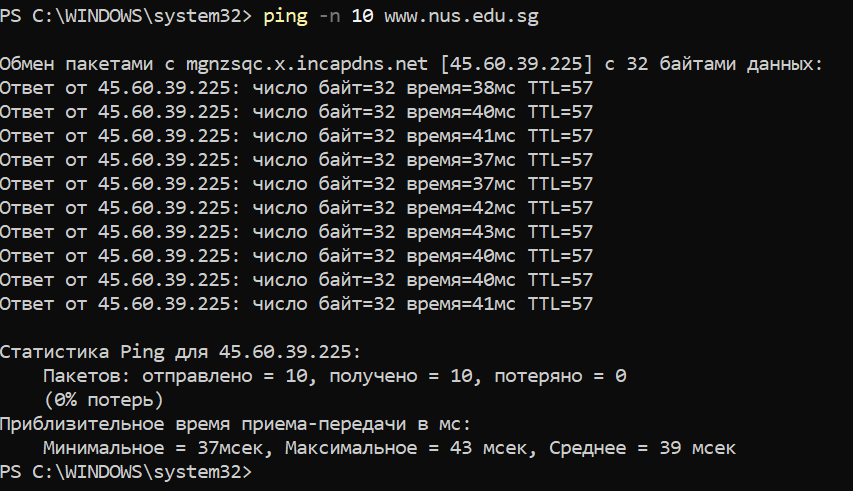
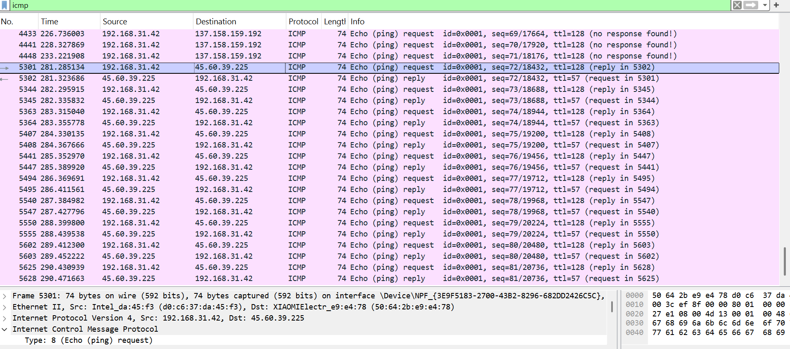
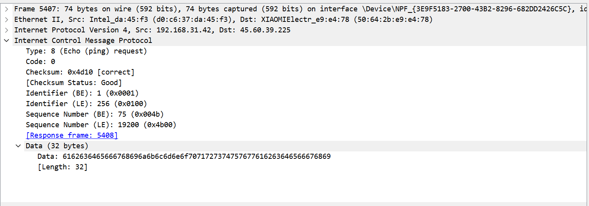
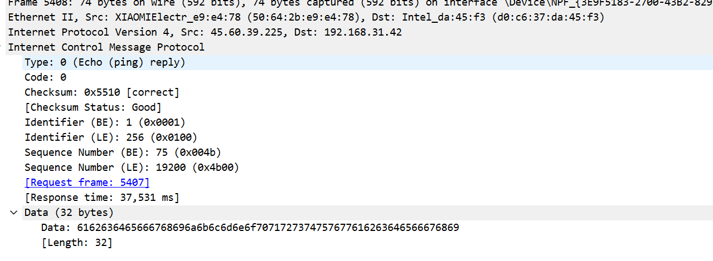
#### Вопросы
1. Каков IP-адрес вашего хоста? Каков IP-адрес хоста назначения?
   - 192.168.31.42
   - 45.60.39.225
2. Почему ICMP-пакет не обладает номерами исходного и конечного портов?
   - Потому что работают на сетевом уровне (Layer 3). Портами оперируют протоколы транспортного уровня, такие как TCP и UDP, чтобы различать приложения и сервисы на узлах. 
3. Рассмотрите один из ping-запросов, отправленных вашим хостом. Каковы ICMP-тип и кодовый
   номер этого пакета? Какие еще поля есть в этом ICMP-пакете? Сколько байт приходится на поля 
   контрольной суммы, порядкового номера и идентификатора?
   - Тип 8 (Echo Request), Code: 0
   - по 2 байта на Checksum (Контрольная сумма), Identifier (Идентификатор), Sequence Number (Порядковый номер), Optional Data (Необязательные данные)
4. Рассмотрите соответствующий ping-пакет, полученный в ответ на предыдущий. 
   Каковы ICMP-тип и кодовый номер этого пакета? Какие еще поля есть в этом ICMP-пакете? 
   Сколько байт приходится на поля контрольной суммы, порядкового номера и идентификатора?
   - Тип 0 (Echo reply), Code: 0
   - Checksum (Контрольная сумма), Identifier (Идентификатор), Sequence Number (Порядковый номер), Optional Data (Необязательные данные)
   - 2 байта

### 2. Traceroute (4 балла)
Программа Traceroute может применяться для определения пути, по которому пакет попал с
исходного на конечный хост.

Traceroute отсылает первый пакет со значением TTL = 1, второй – с TTL = 2 и т.д. Каждый
маршрутизатор понижает TTL-значение пакета, когда пакет проходит через этот маршрутизатор.
Когда на маршрутизатор приходит пакет со значением TTL = 1, этот маршрутизатор отправляет
обратно к источнику ICMP-пакет, свидетельствующий об ошибке.

Задача – захватить ICMP пакеты, инициированные программой traceroute, в сниффере Wireshark.
В ОС Windows вы можете запустить: `tracert host_name`

Выберите хост, который **расположен на другом континенте**.
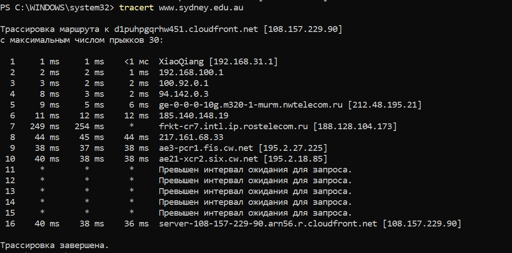
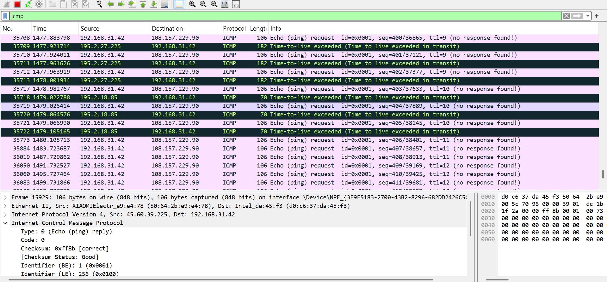
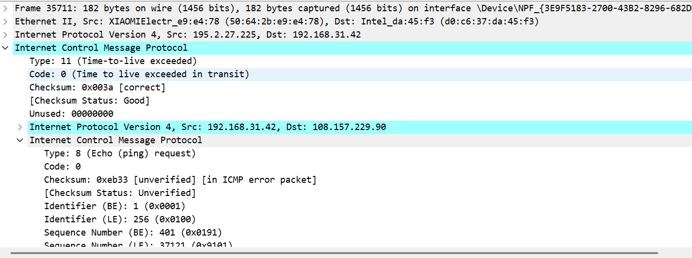
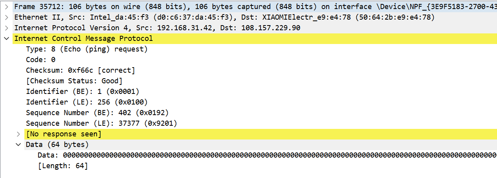
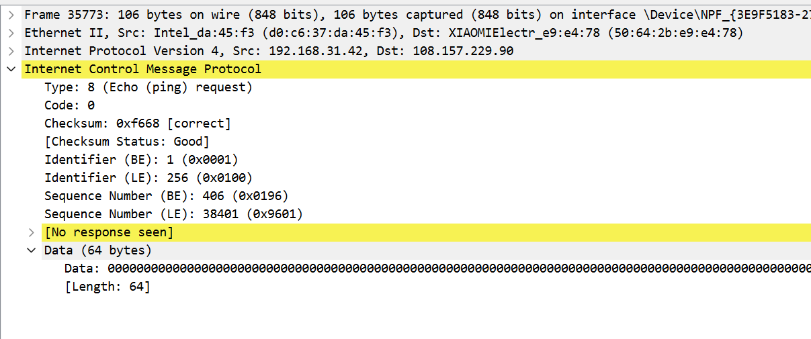
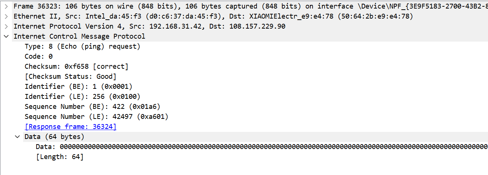
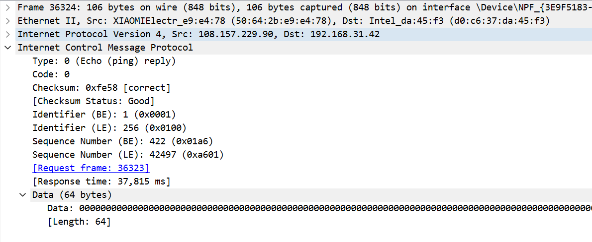
#### Вопросы
1. Рассмотрите ICMP-пакет с эхо-запросом на вашем скриншоте. Отличается ли он от ICMP-пакетов
   с ping-запросами из Задания 1 (Ping)? Если да – то как?
   - Нет, не отличается
2. Рассмотрите на вашем скриншоте ICMP-пакет с сообщением об ошибке. В нем больше полей,
   чем в ICMP-пакете с эхо-запросом. Какая информация содержится в этих дополнительных полях?
   - Сообщение "Time Exceeded" (тип 11, код 0) включает IP-заголовок исходного пакета и первые 8 байт его полезной нагрузки, чтобы можно было идентифицировать этот пакет.
3. Рассмотрите три последних ICMP-пакета, полученных исходным хостом. Чем эти пакеты
   отличаются от ICMP-пакетов, сообщающих об ошибках? Чем объясняются такие отличия?
   - Отличаются типом: 0 и 11
   - Так как датаграмма дошла до целевого хоста
4. Есть ли такой канал, задержка в котором существенно превышает среднее значение? Можете
   ли вы, опираясь на имена маршрутизаторов, определить местоположение двух маршрутизаторов,
   расположенных на обоих концах этого канала?
   Наиболее заметный скачок задержки наблюдается между 6-м и 7-м хопами:
   - Хоп 6: 11–12 мс (среднее ~11.7 мс)
   
   Хоп 7: 249–254 мс (среднее ~251.5 мс). Это резкое увеличение задержки говорит о переходе через значительное расстояние, скорее всего межконтинентальному каналу. По именам маршрутизаторов можно предположить следующее:

Хоп 6: IP 185.140.148.19 — конкретное имя не указано, но предыдущий хоп 5 — ge-0-0-0-10g.m320-1-murm.nwtelecom.ru [212.48.195.21] — принадлежит российскому оператору NW Telecom, а домен "murm" указывает на Мурманск (Россия). Следовательно, хоп 6, скорее всего, тоже в России.

Хоп 7: frkt-cr7.intl.ip.rostelecom.ru [188.128.104.173] — "rostelecom.ru" — российский провайдер, а "intl" в имени указывает на международный канал. Значительный скачок задержки и наличие слова "intl" говорит, что этот маршрутизатор — точка выхода из России на международный канал, возможно к Австралии.

## Программирование.

### 1. IP-адрес и маска сети (1 балл)
Напишите консольное приложение, которое выведет IP-адрес вашего компьютера и маску сети на консоль.

#### Демонстрация работы
Нужно установить в venv библиотеку netifaces

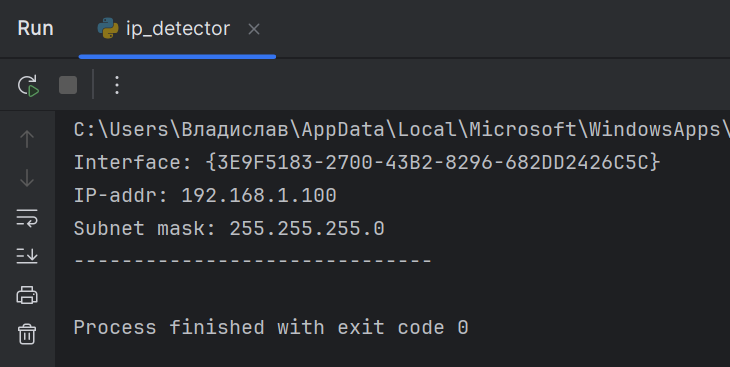

### 2. Доступные порты (2 балла)
Выведите все доступные (свободные) порты в указанном диапазоне для заданного IP-адреса. 
IP-адрес и диапазон портов должны передаваться в виде входных параметров.

#### Демонстрация работы
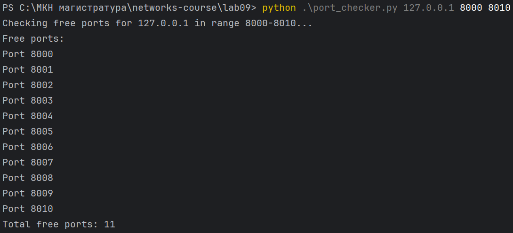

### 3. Широковещательная рассылка для подсчета копий приложения (6 баллов)
Разработать приложение, подсчитывающее количество копий себя, запущенных в локальной сети.
Приложение должно использовать набор сообщений, чтобы информировать другие приложения
о своем состоянии. После запуска приложение должно рассылать широковещательное сообщение
о том, что оно было запущено. Получив сообщение о запуске другого приложения, оно должно
сообщать этому приложению о том, что оно работает. Перед завершением работы приложение
должно информировать все известные приложения о том, что оно завершает работу. На экран
должен выводиться список IP адресов компьютеров (с указанием портов), на которых приложение
запущено.

Приложение считает другое приложение запущенным, если в течение промежутка времени,
равного нескольким интервалам между рассылками широковещательных сообщений, от него
пришло сообщение.

**Такое приложение может быть использовано, например, при наличии ограничения на
количество лицензионных копий программ.*

Пример GUI:

#### Демонстрация работы
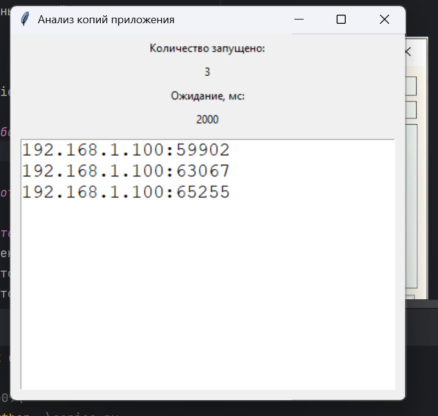

После закрытия нескольких копий число уменьшается:

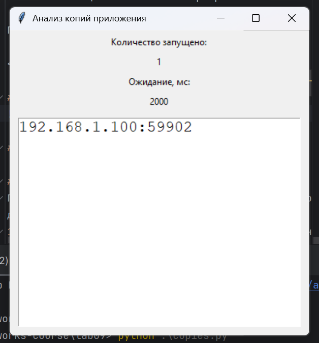

## Задачи. Работа протокола TCP

### Задача 1. Докажите формулы (3 балла)
Пусть за период времени, в который изменяется скорость соединения с $\frac{W}{2 \cdot RTT}$
до $\frac{W}{RTT}$, только один пакет был потерян (очень близко к концу периода).
1. Докажите, что частота потери $L$ (доля потерянных пакетов) равна
   $$L = \dfrac{1}{\frac{3}{8} W^2 + \frac{3}{4} W}$$
2. Используйте выше полученный результат, чтобы доказать, что, если частота потерь равна
   $L$, то средняя скорость приблизительно равна
   $$\approx \dfrac{1.22 \cdot MSS}{RTT \cdot \sqrt{L}}$$

#### Решение
Часть 1: Доказательство частоты потери (L)

В протоколе TCP окно перегрузки увеличивается аддитивно в фазе избегания перегрузки. В данном случае окно растет с 
$\frac{W}{2}$ до $W$ за $\frac{W}{2}$ RTT, так как за каждый RTT размер окна увеличивается на 1 пакет. Потеря одного пакета происходит, когда окно достигает размера $W$, близко к концу периода.

Общее количество отправленных пакетов $N$ за цикл — сумма пакетов, отправленных за каждый RTT, пока окно увеличивается 
с $\frac{W}{2}$ до $W$:

Первый RTT: $\frac{W}{2}$ пакетов

Второй RTT: $\frac{W}{2} + 1$ пакетов

...

Последний RTT: $W$ пакетов

Количество RTT равно $\frac{W}{2}$, сумма пакетов — это арифметическая прогрессия:

$ N = \sum_{k=0}^{\frac{W}{2}} \left( \frac{W}{2} + k \right) $

Число членов суммы — $\frac{W}{2} + 1$ от $k=0$ до $k=\frac{W}{2}$. Используем формулу суммы арифметической прогрессии:

$ N = (\text{число членов}) \cdot (\text{среднее первого и последнего члена}) $

Первый член: $\frac{W}{2}$, последний член: $W$,

$ N = \left( \frac{W}{2} + 1 \right) \cdot \frac{\frac{W}{2} + W}{2} = \left( \frac{W}{2} + 1 \right) \cdot 
\frac{\frac{W}{2} + \frac{2W}{2}}{2} = \left( \frac{W}{2} + 1 \right) \cdot \frac{\frac{3W}{2}}{2} = \left( \frac{W}{2} + 1 \right) \cdot \frac{3W}{4} 
= \frac{3W}{4} \cdot \frac{W + 2}{2} = \frac{3W (W + 2)}{8} = \frac{3W^2 + 6W}{8} = \frac{3W^2}{8} + \frac{3W}{4} $

Поскольку потерян только один пакет за цикл, частота потери:

$ L = \frac{1}{N} = \frac{1}{\frac{3}{8} W^2 + \frac{3}{4} W} $

Часть 2: Доказательство средней скорости

Средняя скорость — количество данных, переданных за единицу времени. За цикл отправляется $N = \frac{3}{8} W^2 + \frac{3}{4} W$
пакетов размером MSS за время $\frac{W}{2} \cdot RTT$ (время увеличения окна с $\frac{W}{2}$ до $W$. Таким образом:

$ \text{Среднее} = \frac{N \cdot MSS}{\frac{W}{2} \cdot RTT} = \frac{\left( \frac{3}{8} W^2 + \frac{3}{4} W \right) \cdot MSS}{\frac{W}{2} \cdot RTT} = \frac{\frac{3}{8} W^2 + \frac{3}{4} W}{\frac{W}{2}} \cdot \frac{MSS}{RTT} $

$ = \left( \frac{3}{8} W^2 \cdot \frac{2}{W} + \frac{3}{4} W \cdot \frac{2}{W} \right) \cdot \frac{MSS}{RTT} = \left( \frac{3}{4} W + \frac{3}{2} \right) \cdot \frac{MSS}{RTT} $

Для больших $W$, $\frac{3}{2}$ пренебрежимо мало, поэтому:

$ \text{Среднее} \approx \frac{3}{4} W \cdot \frac{MSS}{RTT} $

Теперь выразим W через L. Из части 1:

$ L = \frac{1}{\frac{3}{8} W^2 + \frac{3}{4} W} \approx \frac{1}{\frac{3}{8} W^2} \quad (\text{для больших } W), $

$ W^2 \approx \frac{8}{3 L}, \quad W \approx \sqrt{\frac{8}{3 L}} $

Подставим в $Среднее$:

$ \text{Среднее} \approx \frac{3}{4} \cdot \sqrt{\frac{8}{3 L}} \cdot \frac{MSS}{RTT} = \frac{3}{4} \cdot \sqrt{\frac{8}{3}} \cdot \frac{MSS}{RTT \cdot \sqrt{L}} $

Вычислим константу:

$ \sqrt{\frac{8}{3}} = \frac{\sqrt{8}}{\sqrt{3}} = \frac{2 \sqrt{2}}{\sqrt{3}}, \quad \frac{3}{4} \cdot \frac{2 \sqrt{2}}{\sqrt{3}} = \frac{3 \sqrt{2}}{2 \sqrt{3}} = \frac{3}{2} \sqrt{\frac{2}{3}} $

$ \sqrt{\frac{2}{3}} \approx 0.8165, \quad \frac{3}{2} \cdot 0.8165 \approx 1.2247 \approx 1.22 $

$ \text{Среднее} \approx \frac{1.22 \cdot MSS}{RTT \cdot \sqrt{L}} $

Формула доказана.

### Задача 2. Найдите функциональную зависимость (3 балла)
Рассмотрим модификацию алгоритма управления перегрузкой протокола TCP. Вместо
аддитивного увеличения, мы можем использовать мультипликативное увеличение. 
TCP-отправитель увеличивает размер своего окна в небольшую положительную 
константу $a$ ($a > 1$), как только получает верный ACK-пакет.
1. Найдите функциональную зависимость между частотой потерь $L$ и максимальным
размером окна перегрузки $W$.
2. Докажите, что для этого измененного протокола TCP, независимо от средней пропускной
способности, TCP-соединение всегда требуется одинаковое количество времени для
увеличения размера окна перегрузки с $\frac{W}{2}$ до $W$.

#### Решение
Часть 1: Функциональная зависимость между (L) и (W)

Окно увеличивается как $(W \cdot a)$ за каждый RTT, начиная с $(\frac{W}{2})$, пока не достигает $W$, после чего 
происходит потеря одного пакета, и окно сбрасывается до $(\frac{W}{2})$.

$(w_0 = \frac{W}{2})$

$(w_1 = a \cdot \frac{W}{2})$

$(w_k = a^k \cdot \frac{W}{2})$

Когда $w_k \geq W$: $[ a^k \cdot \frac{W}{2} \geq W, \quad a^k \geq 2, \quad k \geq \log_a 2 ]$

Количество RTT до потери — $(k + 1)$, где $(k = \lfloor \log_a 2 \rfloor)$, но для простоты считаем, что потеря происходит,
когда $w_k = W$, то есть $a^k = 2$.

Общее количество пакетов за цикл:

$N = \sum_{i=0}^{k} w_i = \frac{W}{2} + a \cdot \frac{W}{2} + \cdots + a^k \cdot \frac{W}{2} = \frac{W}{2} \sum_{i=0}^{k} a^i$ 

Сумма геометрической прогрессии:

$\sum_{i=0}^{k} a^i = \frac{a^{k+1} - 1}{a - 1}, \quad N = \frac{W}{2} \cdot \frac{a^{k+1} - 1}{a - 1}$

При $a^k = 2, a^{k+1} = 2a$, тогда:

$N = \frac{W}{2} \cdot \frac{2a - 1}{a - 1}$

Частота потери:

$L = \frac{1}{N} = \frac{2 (a - 1)}{(2a - 1) W}$

Зависимость: $(L \propto \frac{1}{W})$.

Часть 2: Одинаковое время увеличения окна

Время увеличения окна с $\frac{W}{2}$ до $W$:

$ a^k \cdot \frac{W}{2} = W, \quad a^k = 2, \quad k = \log_a 2 $

Количество RTT равно $\lceil \log_a 2 \rceil$, что зависит только от $a$ и не зависит от $W$ или пропускной способности.
Следовательно, время всегда одинаково и равно $\lceil \log_a 2 \rceil \cdot RTT$.
